# VisitIQ Model Flow Architecture

This document provides a comprehensive overview of the AI/ML model pipeline and processing flow in the VisitIQ retail analytics system.

## High-Level System Flow


---

## Detailed Model Components

### 1. Object Detection - YOLO


**Key Parameters:**
| Parameter | Value | Description |
|-----------|-------|-------------|
| `DETECTION_CONF_THR` | 0.40 | Person detection confidence |
| `CHAIR_DETECTION_CONF_THR` | 0.45 | Chair detection confidence |
| `CUP_DETECTION_CONF_THR` | 0.45 | Cup detection confidence |
| `YOLO_IMGSZ` | 640 | Inference image size |

---

### 2. Object Tracking - SimpleTracker


**Key Parameters:**
| Parameter | Value | Description |
|-----------|-------|-------------|
| `MAX_DISAPPEARED` | 120 | Frames before track removal (~4s at 30fps) |
| `ASSIGN_DIST` | 220.0 | Max distance for track assignment |
| `IOU_ASSIGNMENT_THRESHOLD` | 0.25 | IoU threshold for assignment |

---

### 3. Face Embedding Pipeline


---

### 4. Age & Gender Detection


**Key Models:**
| Model | Source | Purpose | Accuracy |
|-------|--------|---------|----------|
| ViT Gender Classifier | HuggingFace rizvandwiki | Gender classification | 92.4% |
| DeepFace Age | DeepFace library | Age estimation | ~5 years MAE |

---

### 5. Body/Context Embedding - CLIP


**Captured Features:**
- Clothing patterns and colors
- Body shape and posture
- Scene context (counter, display area, etc.)
- Background elements for location association

---

### 6. Multi-Modal Embedding Fusion


**Fusion Strategy:**
```
Fused = w_face × E_face + w_body × E_body + w_context × E_context
```

---

### 7. Customer Matching & Registry


**Key Parameters:**
| Parameter | Value | Description |
|-----------|-------|-------------|
| `MATCH_THRESHOLD_DEFAULT` | 0.58 | Minimum similarity for match |
| `MAX_EMBEDDINGS_PER_CUSTOMER` | 10 | Embeddings stored per customer |
| `CACHE_REFRESH_INTERVAL_SEC` | 300 | Cache refresh interval (5 min) |

---

## Device Configuration & Hardware Acceleration


**ONNX Execution Providers:**
| Device | Provider |
|--------|----------|
| NVIDIA CUDA | CUDAExecutionProvider |
| Apple MPS | CoreMLExecutionProvider |
| CPU | CPUExecutionProvider |

---

## Complete Pipeline Summary

```mermaid
flowchart LR
    subgraph Pipeline["Complete Processing Pipeline"]
        A["📹 Video Frame"] --> B["🔧 OpenCV<br/>Preprocess"]
        B --> C["🎯 YOLO<br/>Detection"]
        C --> D["📍 SimpleTracker<br/>Tracking"]
        D --> E["👤 Face Pipeline<br/>AdaFace/DeepFace"]
        E --> F["🎂 Age/Gender<br/>HF-ViT/DeepFace"]
        D --> G["👔 CLIP<br/>Body/Context"]
        E & G --> H["🔀 Multi-Modal<br/>Fusion"]
        H --> I["🔄 Customer<br/>Registry"]
        D & F & I --> J["📊 Analytics<br/>Output"]
    end
```



---

## Library Dependencies

| Component | Library | Version | Purpose |
|-----------|---------|---------|---------|
| Object Detection | ultralytics | Latest | YOLO v8/v11 |
| Image Processing | opencv-python | Latest | Frame capture, preprocessing |
| Face Recognition | deepface | Latest | Face analysis, age estimation |
| Face Embeddings | insightface | ≥0.7.3 | AdaFace embeddings |
| ONNX Inference | onnxruntime | Latest | InsightFace backend |
| Body Embeddings | CLIP (OpenAI) | git | Context/body features |
| Gender Classification | transformers | Latest | HuggingFace ViT model |
| Deep Learning | torch | ≥2.0.0 | PyTorch backend |
| Image Utils | Pillow | Latest | Image format conversion |
| Scientific Computing | numpy, scipy | Latest | Array operations |

---

## Environment Variables

| Variable | Default | Description |
|----------|---------|-------------|
| `YOLO_IMGSZ` | 640 | YOLO inference image size |
| `ADAFACE_ENABLED` | 1 | Enable AdaFace embedder |
| `HFGENDER_ENABLED` | 0 | Enable HuggingFace gender classifier |
| `MULTIMODAL_ENABLED` | 0 | Enable multi-modal fusion |
| `CLIP_ENABLED` | 1 | Enable CLIP embeddings |
| `ENABLE_AGE_GENDER` | 1 | Enable age/gender detection |
